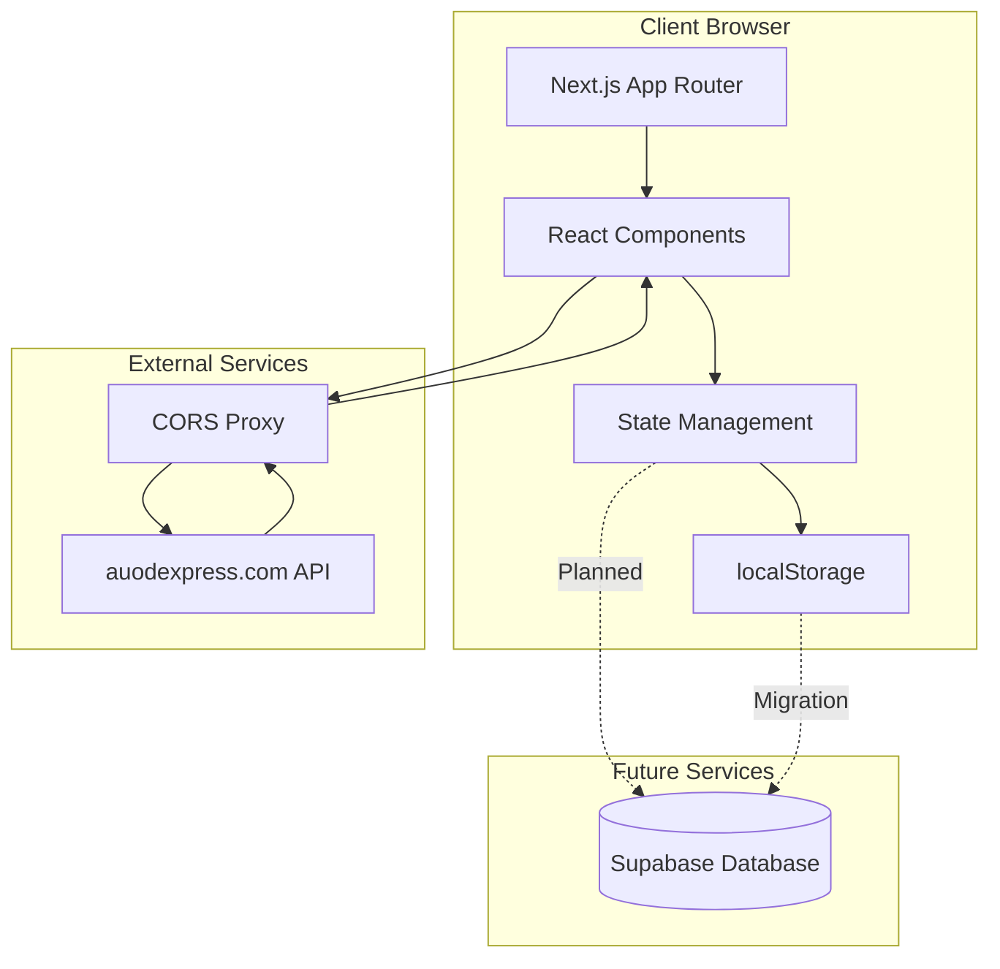
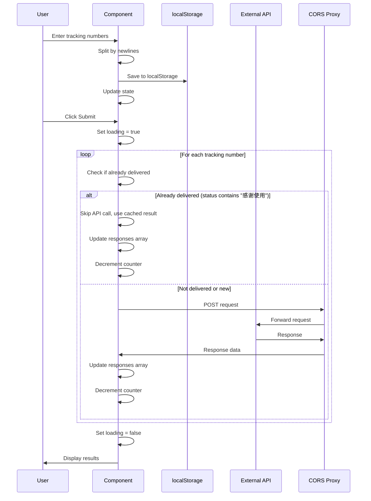
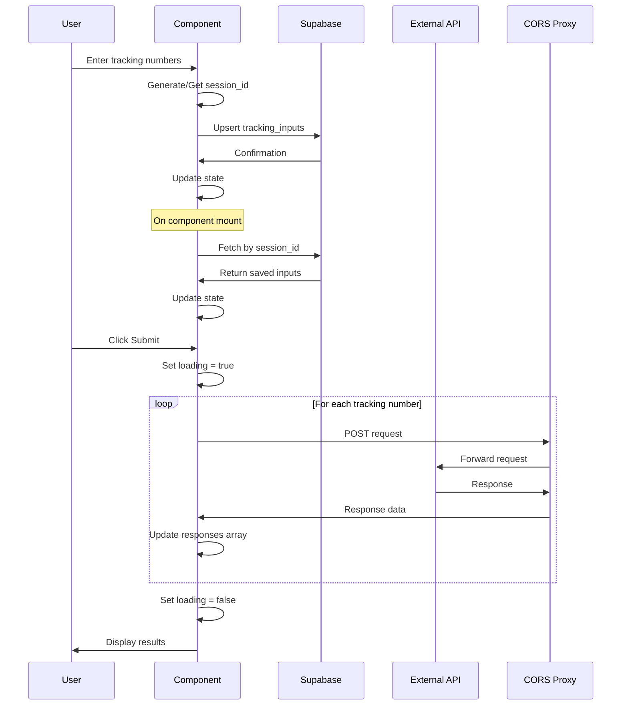

# Architecture Documentation
## My Tracker Application

**Version:** 1.0  
**Last Updated:** 2024

---

## System Overview

My Tracker is a client-side web application built with Next.js that enables users to track multiple shipping numbers simultaneously. The application follows a modern React architecture with server-side rendering capabilities through Next.js App Router.

### High-Level Architecture



## Component Architecture

### Component Hierarchy

```mermaid
flowchart TD
    A[RootLayout] --> B[App Router]
    B --> C[/track Page]
    C --> D[App Component]
    D --> E[Textarea Input]
    D --> F[Submit Button]
    D --> G[ResultList Component]
    D --> H[Error Display]
    D --> I[Loading Indicator]
    D --> J[Progress Counter]
    
    G --> K[Result Items]
```

### Component Details

#### RootLayout (`src/app/layout.tsx`)
- **Purpose**: Root layout wrapper for all pages
- **Responsibilities**: 
  - Font configuration (Geist Sans, Geist Mono)
  - Global CSS application
  - Metadata configuration
- **Type**: Server Component (Next.js)

#### Track Page (`src/app/track/page.tsx`)
- **Purpose**: Main tracking interface
- **Type**: Client Component (`'use client'`)
- **State Management**:
  - `texts`: Array of tracking numbers
  - `responses`: Array of API response data
  - `error`: Error message state
  - `loading`: Loading state
  - `count`: Progress counter

#### ResultList Component (`src/app/track/resultList.tsx`)
- **Purpose**: Display tracking results with status classification
- **Props**:
  - `trackNo`: Array of tracking numbers
  - `results`: Array of API response objects
- **Type**: Client Component
- **Features**:
  - Status classification with color coding:
    - Delivered (contains "感谢使用"): Red border and background
    - In Transit (contains "您的快件" or "正在派件"): Amber/yellow border and background
    - Other: Default styling
  - Express code display for delivered and in-transit items
  - Error message display when `result.result === false`

### File Structure

```
src/
├── app/
│   ├── layout.tsx          # Root layout
│   ├── page.tsx            # Home page (default Next.js)
│   ├── globals.css         # Global styles
│   └── track/
│       ├── page.tsx        # Main tracking page
│       └── resultList.tsx  # Results display component
└── lib/                    # Future: Utility functions
    └── supabase.ts         # Planned: Supabase client
```

## Data Flow

### Current Data Flow (localStorage)



### Future Data Flow (Supabase)



## State Management

### React State Pattern

The application uses React's built-in `useState` hooks for state management. No external state management library is currently used.

#### State Variables

```typescript
// Tracking numbers input
const [texts, setTexts] = useState<string[]>([]);

// API responses
const [responses, setResponses] = useState<ResponseType[]>([]);

// Error handling
const [error, setError] = useState<string | null>(null);

// Loading state
const [loading, setLoading] = useState(false);

// Progress counter
const [count, setCount] = useState(0);
```

#### State Updates

1. **On Mount**: Load from localStorage → `setTexts()`
2. **On Input Change**: Update state → Save to localStorage → Sync responses
3. **On Submit**: 
   - Set loading → Check each tracking number for delivered status
   - For delivered items: Skip API call, use cached result
   - For non-delivered items: Process API calls → Update responses → Decrement counter
   - Clear loading when all queries complete
4. **On API Response**: Append to responses → Decrement counter

### State Synchronization

The application maintains correspondence between `texts` and `responses` arrays:

```typescript
// When inputs change, sync responses to maintain index alignment
setResponses(prevResponses => {
  return lines.reduce((newResponses, currentLine) => {
    const previousIndex = previousLines.indexOf(currentLine);
    if (previousIndex !== -1 && previousIndex < prevResponses.length) {
      newResponses.push(prevResponses[previousIndex]);
    }
    return newResponses;
  }, []);
});
```

## Storage Architecture

### Current: localStorage

**Storage Location**: Browser's localStorage  
**Key**: `'previousInputs'`  
**Format**: JSON stringified array of strings  
**Scope**: Per-browser, per-domain  
**Limitations**: 
- Single device only
- No cross-device sync
- Limited storage capacity (~5-10MB)
- No server backup

**Implementation**:
```typescript
// Save
localStorage.setItem('previousInputs', JSON.stringify(lines));

// Load
const stored = localStorage.getItem('previousInputs');
if (stored) {
  setTexts(JSON.parse(stored));
}
```

### Future: Supabase

**Storage Location**: Supabase PostgreSQL database  
**Table**: `tracking_inputs`  
**Identification**: Browser session ID (stored in localStorage)  
**Benefits**:
- Cross-device synchronization
- Server-side backup
- Scalable storage
- Query capabilities

**Schema**:
```sql
CREATE TABLE tracking_inputs (
  id UUID PRIMARY KEY DEFAULT gen_random_uuid(),
  session_id TEXT NOT NULL,
  inputs TEXT[] NOT NULL,
  created_at TIMESTAMP DEFAULT NOW(),
  updated_at TIMESTAMP DEFAULT NOW()
);
```

**Access Pattern**:
- **Read**: Fetch by `session_id` on component mount
- **Write**: Upsert on input change (match by `session_id`)

## API Integration

### External API Details

**Endpoint**: `http://sys-new-api.auodexpress.com/api/tms/userSys/client/getRouterList`  
**Method**: POST  
**Content-Type**: application/json  
**Payload**:
```json
{
  "wayBillCode": "TRACKING_NUMBER"
}
```

**Response Structure**:
```typescript
{
  data: {
    hisList: [
      {
        toStatus: string,
        createDate: string
      }
    ]
  }
}
```

### CORS Handling

**Problem**: External API doesn't allow direct browser requests due to CORS policy.

**Solution**: Use CORS proxy service (cors-anywhere.herokuapp.com)

**Proxy URL Format**:
```
https://cors-anywhere.herokuapp.com/http://sys-new-api.auodexpress.com/api/...
```

**Limitations**:
- Dependency on external proxy service
- Proxy may require manual activation (demo page)
- Potential reliability issues

**Future Consideration**: Self-hosted CORS proxy or Next.js API route proxy

### Request Processing

**Current**: Sequential processing
```typescript
for (const text of texts) {
  const response = await axios.post(endpoint, { wayBillCode: text });
  // Process response
}
```

**Benefits**: Simple, predictable  
**Drawbacks**: Slow for large batches

**Future**: Parallel processing with Promise.all() or batch API calls

## Deployment Architecture

### Current Deployment

**Platform**: Next.js (can be deployed to Vercel, Netlify, or self-hosted)  
**Build**: Static export or server-side rendering  
**Environment**: Node.js runtime

### Deployment Options

#### Option 1: Vercel (Recommended)
- **Pros**: Optimized for Next.js, automatic deployments, CDN
- **Cons**: Platform lock-in
- **Setup**: Connect GitHub repository

#### Option 2: Netlify
- **Pros**: Similar to Vercel, good Next.js support
- **Cons**: Slightly less optimized than Vercel
- **Setup**: Connect repository, configure build settings

#### Option 3: Self-Hosted
- **Pros**: Full control, no vendor lock-in
- **Cons**: Requires server management, infrastructure setup
- **Setup**: Docker container or Node.js server

### Environment Variables

**Required** (Future - Supabase):
```
NEXT_PUBLIC_SUPABASE_URL=https://xxx.supabase.co
NEXT_PUBLIC_SUPABASE_ANON_KEY=xxx
```

**Optional**:
```
NEXT_PUBLIC_API_ENDPOINT=http://sys-new-api.auodexpress.com/api/...
NEXT_PUBLIC_CORS_PROXY=https://cors-anywhere.herokuapp.com
```

## Security Considerations

### Current Security

1. **No Authentication**: Application is publicly accessible
2. **Client-Side Storage**: Data stored in browser localStorage
3. **CORS Proxy**: External dependency for API access
4. **No Input Validation**: Accepts any text input

### Future Security (Supabase Migration)

1. **Row Level Security (RLS)**: 
   - Anonymous read/write access
   - Session-based data isolation
   - Prevent unauthorized access

2. **Input Validation**:
   - Validate tracking number format
   - Sanitize user input
   - Prevent injection attacks

3. **Rate Limiting**:
   - Limit API calls per session
   - Prevent abuse
   - Consider Supabase rate limits

## Performance Considerations

### Current Performance

**Strengths**:
- Fast initial load (static assets)
- Immediate UI updates
- Efficient React rendering

**Bottlenecks**:
- Sequential API processing
- CORS proxy latency
- No response caching

### Optimization Opportunities

1. **Parallel API Calls**: Process multiple requests concurrently
2. **Response Caching**: Cache API responses to reduce redundant calls
3. **Debouncing**: Debounce input saves to reduce database writes
4. **Code Splitting**: Lazy load components if needed
5. **Image Optimization**: Not applicable (no images currently)

## Future Architecture Considerations

### Scalability

**Current**: Suitable for individual/small team use  
**Future Needs**:
- Support for more concurrent users
- Handle larger batch sizes
- Database query optimization

### Monitoring

**Recommended**:
- Error tracking (Sentry, LogRocket)
- Performance monitoring (Vercel Analytics)
- API usage tracking
- Database query monitoring (Supabase dashboard)

### Testing Strategy

**Current**: Manual testing  
**Future**:
- Unit tests for components
- Integration tests for API calls
- E2E tests for user flows
- Database migration tests

---

*This architecture documentation will be updated as the system evolves.*
