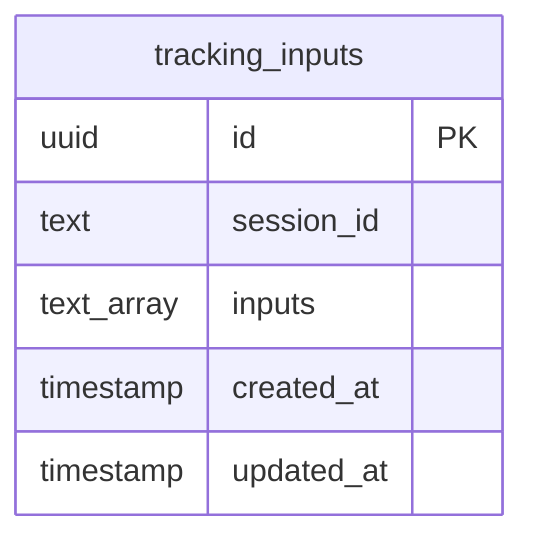
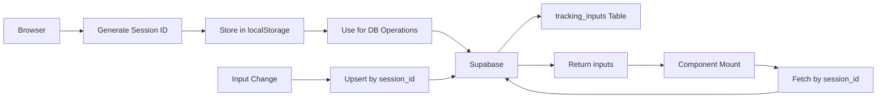

# Database Schema Documentation
## My Tracker Application - Supabase Migration

**Version:** 1.0  
**Last Updated:** 2024  
**Status:** Planned (Not Yet Implemented)

---

## Overview

This document describes the planned database schema for migrating from localStorage to Supabase. The migration will enable cross-device synchronization and better data persistence for tracking number inputs.

## Database Platform

**Platform**: Supabase (PostgreSQL)  
**Access**: Anonymous (no authentication required)  
**Identification**: Browser session ID stored in localStorage

## Schema Design

### Table: `tracking_inputs`

Stores tracking number inputs per browser session.

#### Table Structure

```sql
CREATE TABLE tracking_inputs (
  id UUID PRIMARY KEY DEFAULT gen_random_uuid(),
  session_id TEXT NOT NULL,
  inputs TEXT[] NOT NULL DEFAULT '{}',
  created_at TIMESTAMP WITH TIME ZONE DEFAULT NOW(),
  updated_at TIMESTAMP WITH TIME ZONE DEFAULT NOW()
);
```

#### Column Descriptions

| Column | Type | Constraints | Description |
|--------|------|-------------|-------------|
| `id` | UUID | PRIMARY KEY, DEFAULT gen_random_uuid() | Unique identifier for each record |
| `session_id` | TEXT | NOT NULL | Browser session identifier (stored in localStorage) |
| `inputs` | TEXT[] | NOT NULL, DEFAULT '{}' | Array of tracking numbers |
| `created_at` | TIMESTAMP | DEFAULT NOW() | Record creation timestamp |
| `updated_at` | TIMESTAMP | DEFAULT NOW() | Last update timestamp |

#### Indexes

```sql
-- Index for fast lookups by session_id
CREATE INDEX idx_tracking_inputs_session_id ON tracking_inputs(session_id);

-- Index for cleanup of old records (optional)
CREATE INDEX idx_tracking_inputs_updated_at ON tracking_inputs(updated_at);
```

#### Updated At Trigger

Automatically update `updated_at` timestamp on row updates:

```sql
CREATE OR REPLACE FUNCTION update_updated_at_column()
RETURNS TRIGGER AS $$
BEGIN
    NEW.updated_at = NOW();
    RETURN NEW;
END;
$$ language 'plpgsql';

CREATE TRIGGER update_tracking_inputs_updated_at
    BEFORE UPDATE ON tracking_inputs
    FOR EACH ROW
    EXECUTE FUNCTION update_updated_at_column();
```

## Row Level Security (RLS)

### Policy: Anonymous Read/Write

Allow anonymous users to read and write their own session data:

```sql
-- Enable RLS
ALTER TABLE tracking_inputs ENABLE ROW LEVEL SECURITY;

-- Policy: Allow anonymous users to read their own session data
CREATE POLICY "Allow anonymous read own session"
ON tracking_inputs
FOR SELECT
TO anon
USING (true);

-- Policy: Allow anonymous users to insert their own session data
CREATE POLICY "Allow anonymous insert own session"
ON tracking_inputs
FOR INSERT
TO anon
WITH CHECK (true);

-- Policy: Allow anonymous users to update their own session data
CREATE POLICY "Allow anonymous update own session"
ON tracking_inputs
FOR UPDATE
TO anon
USING (true)
WITH CHECK (true);

-- Policy: Allow anonymous users to delete their own session data (optional)
CREATE POLICY "Allow anonymous delete own session"
ON tracking_inputs
FOR DELETE
TO anon
USING (true);
```

**Note**: The current policies allow full anonymous access. For better security, consider restricting by `session_id` matching, but this requires a custom function or more complex policy.

### Alternative: Session-Based RLS

For stricter security, use a function to validate session ownership:

```sql
-- Function to check session ownership (requires custom implementation)
CREATE OR REPLACE FUNCTION is_session_owner(session_id_param TEXT)
RETURNS BOOLEAN AS $$
BEGIN
  -- Implementation depends on how session_id is validated
  -- For anonymous access, this could check against a session table
  RETURN TRUE; -- Simplified for anonymous access
END;
$$ LANGUAGE plpgsql SECURITY DEFINER;

-- Updated policy using function
CREATE POLICY "Allow anonymous read own session"
ON tracking_inputs
FOR SELECT
TO anon
USING (is_session_owner(session_id));
```

## Data Model

### Entity Relationship



### Data Flow



## Migration Scripts

### Complete Migration Script

```sql
-- Create table
CREATE TABLE IF NOT EXISTS tracking_inputs (
  id UUID PRIMARY KEY DEFAULT gen_random_uuid(),
  session_id TEXT NOT NULL,
  inputs TEXT[] NOT NULL DEFAULT '{}',
  created_at TIMESTAMP WITH TIME ZONE DEFAULT NOW(),
  updated_at TIMESTAMP WITH TIME ZONE DEFAULT NOW()
);

-- Create indexes
CREATE INDEX IF NOT EXISTS idx_tracking_inputs_session_id 
  ON tracking_inputs(session_id);
CREATE INDEX IF NOT EXISTS idx_tracking_inputs_updated_at 
  ON tracking_inputs(updated_at);

-- Create updated_at trigger function
CREATE OR REPLACE FUNCTION update_updated_at_column()
RETURNS TRIGGER AS $$
BEGIN
    NEW.updated_at = NOW();
    RETURN NEW;
END;
$$ language 'plpgsql';

-- Create trigger
DROP TRIGGER IF EXISTS update_tracking_inputs_updated_at ON tracking_inputs;
CREATE TRIGGER update_tracking_inputs_updated_at
    BEFORE UPDATE ON tracking_inputs
    FOR EACH ROW
    EXECUTE FUNCTION update_updated_at_column();

-- Enable RLS
ALTER TABLE tracking_inputs ENABLE ROW LEVEL SECURITY;

-- Drop existing policies if they exist
DROP POLICY IF EXISTS "Allow anonymous read own session" ON tracking_inputs;
DROP POLICY IF EXISTS "Allow anonymous insert own session" ON tracking_inputs;
DROP POLICY IF EXISTS "Allow anonymous update own session" ON tracking_inputs;
DROP POLICY IF EXISTS "Allow anonymous delete own session" ON tracking_inputs;

-- Create RLS policies
CREATE POLICY "Allow anonymous read own session"
ON tracking_inputs
FOR SELECT
TO anon
USING (true);

CREATE POLICY "Allow anonymous insert own session"
ON tracking_inputs
FOR INSERT
TO anon
WITH CHECK (true);

CREATE POLICY "Allow anonymous update own session"
ON tracking_inputs
FOR UPDATE
TO anon
USING (true)
WITH CHECK (true);

CREATE POLICY "Allow anonymous delete own session"
ON tracking_inputs
FOR DELETE
TO anon
USING (true);
```

### Rollback Script

```sql
-- Disable RLS
ALTER TABLE tracking_inputs DISABLE ROW LEVEL SECURITY;

-- Drop policies
DROP POLICY IF EXISTS "Allow anonymous read own session" ON tracking_inputs;
DROP POLICY IF EXISTS "Allow anonymous insert own session" ON tracking_inputs;
DROP POLICY IF EXISTS "Allow anonymous update own session" ON tracking_inputs;
DROP POLICY IF EXISTS "Allow anonymous delete own session" ON tracking_inputs;

-- Drop trigger
DROP TRIGGER IF EXISTS update_tracking_inputs_updated_at ON tracking_inputs;

-- Drop function
DROP FUNCTION IF EXISTS update_updated_at_column();

-- Drop indexes
DROP INDEX IF EXISTS idx_tracking_inputs_session_id;
DROP INDEX IF EXISTS idx_tracking_inputs_updated_at;

-- Drop table (WARNING: This deletes all data)
-- DROP TABLE IF EXISTS tracking_inputs;
```

## Data Access Patterns

### Read Pattern

**Use Case**: Load saved inputs on component mount

**Query**:
```typescript
const { data, error } = await supabase
  .from('tracking_inputs')
  .select('inputs')
  .eq('session_id', sessionId)
  .single();
```

**SQL Equivalent**:
```sql
SELECT inputs 
FROM tracking_inputs 
WHERE session_id = 'session_id_value' 
LIMIT 1;
```

### Write Pattern (Upsert)

**Use Case**: Save inputs on change

**Query**:
```typescript
const { data, error } = await supabase
  .from('tracking_inputs')
  .upsert(
    {
      session_id: sessionId,
      inputs: trackingNumbers,
      updated_at: new Date().toISOString()
    },
    {
      onConflict: 'session_id'
    }
  )
  .select();
```

**SQL Equivalent**:
```sql
INSERT INTO tracking_inputs (session_id, inputs, updated_at)
VALUES ('session_id_value', ARRAY['track1', 'track2'], NOW())
ON CONFLICT (session_id) 
DO UPDATE SET 
  inputs = EXCLUDED.inputs,
  updated_at = EXCLUDED.updated_at;
```

**Note**: Requires unique constraint on `session_id`:

```sql
ALTER TABLE tracking_inputs 
ADD CONSTRAINT unique_session_id UNIQUE (session_id);
```

### Delete Pattern

**Use Case**: Clear saved inputs (optional feature)

**Query**:
```typescript
const { error } = await supabase
  .from('tracking_inputs')
  .delete()
  .eq('session_id', sessionId);
```

**SQL Equivalent**:
```sql
DELETE FROM tracking_inputs 
WHERE session_id = 'session_id_value';
```

## Session ID Generation

### Implementation

**Location**: Client-side (browser)

**Strategy**: Generate UUID and store in localStorage

```typescript
function getOrCreateSessionId(): string {
  const storageKey = 'tracker_session_id';
  let sessionId = localStorage.getItem(storageKey);
  
  if (!sessionId) {
    sessionId = crypto.randomUUID(); // or use uuid library
    localStorage.setItem(storageKey, sessionId);
  }
  
  return sessionId;
}
```

### Session ID Format

- **Type**: UUID v4 (recommended) or custom string
- **Length**: 36 characters (UUID) or variable
- **Uniqueness**: Should be unique per browser/device
- **Persistence**: Stored in localStorage, persists across sessions

### Alternative: Browser Fingerprint

For more persistent identification without localStorage dependency:

```typescript
// Simple browser fingerprint (less reliable)
function generateBrowserFingerprint(): string {
  const canvas = document.createElement('canvas');
  const ctx = canvas.getContext('2d');
  ctx.textBaseline = 'top';
  ctx.font = '14px Arial';
  ctx.fillText('Browser fingerprint', 2, 2);
  
  const fingerprint = canvas.toDataURL();
  // Combine with other browser characteristics
  return btoa(fingerprint + navigator.userAgent + screen.width + screen.height);
}
```

**Note**: Browser fingerprinting has privacy implications and may be less reliable.

## Data Migration Strategy

### Migration from localStorage

**Current State**: Data stored in localStorage as JSON array

**Migration Steps**:

1. **On First Load After Migration**:
   ```typescript
   // Check if localStorage has old data
   const oldData = localStorage.getItem('previousInputs');
   if (oldData) {
     const inputs = JSON.parse(oldData);
     // Migrate to Supabase
     await migrateToSupabase(inputs);
     // Optionally clear old localStorage data
     // localStorage.removeItem('previousInputs');
   }
   ```

2. **Migration Function**:
   ```typescript
   async function migrateToSupabase(inputs: string[]) {
     const sessionId = getOrCreateSessionId();
     const { error } = await supabase
       .from('tracking_inputs')
       .upsert({
         session_id: sessionId,
         inputs: inputs
       }, {
         onConflict: 'session_id'
       });
     
     if (error) {
       console.error('Migration failed:', error);
     }
   }
   ```

3. **Backward Compatibility**:
   - Keep localStorage as fallback
   - Try Supabase first, fall back to localStorage if Supabase fails
   - Gradually migrate users

## Data Cleanup

### Retention Policy

**Current**: No cleanup (data persists indefinitely)

**Recommended**: Clean up old/unused sessions

### Cleanup Query

```sql
-- Delete records older than 90 days
DELETE FROM tracking_inputs
WHERE updated_at < NOW() - INTERVAL '90 days';
```

### Automated Cleanup

**Option 1**: Supabase Cron Job (Edge Function)
- Run daily/weekly
- Delete old records

**Option 2**: Application-Level Cleanup
- Check on app load
- Delete old sessions

**Option 3**: Database Function + Trigger
- Automatic cleanup on insert/update

## Performance Considerations

### Query Performance

**Indexes**: Ensure `session_id` is indexed for fast lookups

**Query Optimization**:
- Use `.single()` for single row queries
- Limit result sets when possible
- Use `.select()` to fetch only needed columns

### Storage Optimization

**Array Size**: PostgreSQL arrays can handle large sizes, but consider:
- Limit maximum number of tracking numbers per session
- Archive old data to separate table
- Compress data if needed

### Connection Pooling

**Supabase**: Handles connection pooling automatically
- No manual configuration needed
- Optimized for serverless environments

## Security Considerations

### Data Privacy

**Current**: Anonymous access, no user identification

**Considerations**:
- Tracking numbers may contain sensitive information
- Consider encryption for sensitive data
- Implement data retention policies
- Comply with privacy regulations (GDPR, etc.)

### Access Control

**Current**: Full anonymous access

**Future Enhancements**:
- Optional user authentication
- User-specific data isolation
- Admin access controls

### SQL Injection Prevention

**Supabase Client**: Automatically prevents SQL injection
- Use parameterized queries
- Never concatenate user input into SQL

## Monitoring and Analytics

### Recommended Metrics

1. **Table Size**: Monitor table growth
2. **Query Performance**: Track query execution times
3. **Error Rates**: Monitor failed operations
4. **Session Count**: Track unique sessions
5. **Storage Usage**: Monitor database storage

### Supabase Dashboard

- Use Supabase dashboard for monitoring
- Set up alerts for errors
- Monitor API usage and limits

---

*This database documentation will be updated as the migration is implemented.*
