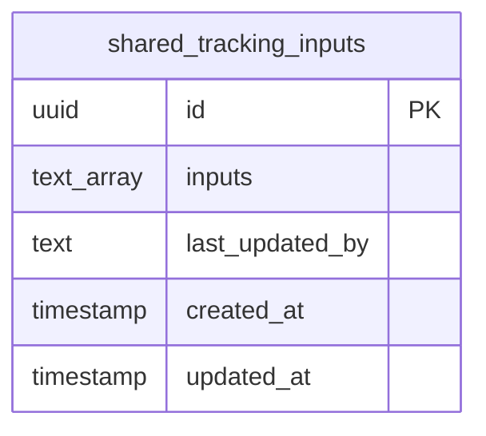
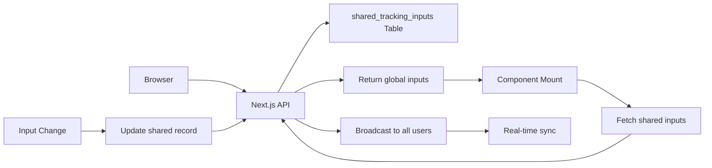

# Database Schema Documentation
## My Tracker Application - Server-side File Storage

**Version:** 1.0  
**Last Updated:** 2024  
**Status:** Planned (Not Yet Implemented)

---

## Overview

This document describes the current storage implementation using Next.js API Routes and server-side file system. The implementation provides persistent storage that survives server restarts and deployments.

## Storage Implementation

**Platform**: Next.js API Routes + File System
**Access**: Server-side persistent storage
**Current Usage**: Single user persistent storage

## File Structure

### Data File: `data/shared-tracking.json`

The application stores tracking data in a JSON file on the server file system.

#### File Content Structure

```json
{
  "inputs": ["TRACK001", "TRACK002", "TRACK003"],
  "lastUpdated": 1703123456789,
  "version": 42
}
```

#### Field Descriptions

| Field | Type | Description |
|-------|------|-------------|
| `inputs` | string[] | Array of tracking numbers entered by the user |
| `lastUpdated` | number | Unix timestamp of the last update |
| `version` | number | Version counter for optimistic concurrency control |

#### Indexes

```sql
-- Index for fast lookups by updated_at (for real-time subscriptions)
CREATE INDEX idx_shared_tracking_inputs_updated_at ON shared_tracking_inputs(updated_at);
```

#### Updated At Trigger

Automatically update `updated_at` timestamp on row updates:

```sql
CREATE OR REPLACE FUNCTION update_updated_at_column()
RETURNS TRIGGER AS $$
BEGIN
    NEW.updated_at = NOW();
    RETURN NEW;
END;
$$ language 'plpgsql';

CREATE TRIGGER update_tracking_inputs_updated_at
    BEFORE UPDATE ON tracking_inputs
    FOR EACH ROW
    EXECUTE FUNCTION update_updated_at_column();
```

## API Endpoints

### GET /api/shared-data

Load stored tracking inputs.

**Response:**
```json
{
  "inputs": ["TRACK001", "TRACK002"],
  "lastUpdated": 1703123456789,
  "version": 42
}
```

### PUT /api/shared-data

Save tracking inputs to server.

**Request:**
```json
{
  "inputs": ["TRACK001", "TRACK002", "TRACK003"]
}
```

**Response:**
```json
{
  "success": true,
  "version": 43
}
```

### Alternative: Session-Based RLS

For stricter security, use a function to validate session ownership:

```sql
-- Function to check session ownership (requires custom implementation)
CREATE OR REPLACE FUNCTION is_session_owner(session_id_param TEXT)
RETURNS BOOLEAN AS $$
BEGIN
  -- Implementation depends on how session_id is validated
  -- For anonymous access, this could check against a session table
  RETURN TRUE; -- Simplified for anonymous access
END;
$$ LANGUAGE plpgsql SECURITY DEFINER;

-- Updated policy using function
CREATE POLICY "Allow anonymous read own session"
ON tracking_inputs
FOR SELECT
TO anon
USING (is_session_owner(session_id));
```

## Data Model

### Entity Relationship



### Data Flow



## Migration Scripts

### Complete Setup Script

```sql
-- Create table
CREATE TABLE IF NOT EXISTS shared_tracking_inputs (
  id UUID PRIMARY KEY DEFAULT gen_random_uuid(),
  inputs TEXT[] NOT NULL DEFAULT '{}',
  last_updated_by TEXT,
  created_at TIMESTAMP WITH TIME ZONE DEFAULT NOW(),
  updated_at TIMESTAMP WITH TIME ZONE DEFAULT NOW()
);

-- Create indexes
CREATE INDEX IF NOT EXISTS idx_shared_tracking_inputs_updated_at
  ON shared_tracking_inputs(updated_at);

-- Create updated_at trigger function
CREATE OR REPLACE FUNCTION update_updated_at_column()
RETURNS TRIGGER AS $$
BEGIN
    NEW.updated_at = NOW();
    RETURN NEW;
END;
$$ language 'plpgsql';

-- Create trigger
DROP TRIGGER IF EXISTS update_shared_tracking_inputs_updated_at ON shared_tracking_inputs;
CREATE TRIGGER update_shared_tracking_inputs_updated_at
    BEFORE UPDATE ON shared_tracking_inputs
    FOR EACH ROW
    EXECUTE FUNCTION update_updated_at_column();

-- Enable RLS
ALTER TABLE shared_tracking_inputs ENABLE ROW LEVEL SECURITY;

-- Drop existing policies if they exist
DROP POLICY IF EXISTS "Allow anonymous read shared data" ON shared_tracking_inputs;
DROP POLICY IF EXISTS "Allow anonymous update shared data" ON shared_tracking_inputs;

-- Create RLS policies
CREATE POLICY "Allow anonymous read shared data"
ON shared_tracking_inputs
FOR SELECT
TO anon
USING (true);

CREATE POLICY "Allow anonymous update shared data"
ON shared_tracking_inputs
FOR UPDATE
TO anon
USING (true)
WITH CHECK (true);

-- Insert initial record (only run this once)
-- INSERT INTO shared_tracking_inputs (inputs) VALUES ('{}')
-- ON CONFLICT DO NOTHING;
```

### Rollback Script

```sql
-- Disable RLS
ALTER TABLE tracking_inputs DISABLE ROW LEVEL SECURITY;

-- Drop policies
DROP POLICY IF EXISTS "Allow anonymous read own session" ON tracking_inputs;
DROP POLICY IF EXISTS "Allow anonymous insert own session" ON tracking_inputs;
DROP POLICY IF EXISTS "Allow anonymous update own session" ON tracking_inputs;
DROP POLICY IF EXISTS "Allow anonymous delete own session" ON tracking_inputs;

-- Drop trigger
DROP TRIGGER IF EXISTS update_tracking_inputs_updated_at ON tracking_inputs;

-- Drop function
DROP FUNCTION IF EXISTS update_updated_at_column();

-- Drop indexes
DROP INDEX IF EXISTS idx_tracking_inputs_session_id;
DROP INDEX IF EXISTS idx_tracking_inputs_updated_at;

-- Drop table (WARNING: This deletes all data)
-- DROP TABLE IF EXISTS tracking_inputs;
```

## Data Access Patterns

### Read Pattern

**Use Case**: Load stored inputs when app starts

**API Call**:
```typescript
const response = await fetch('/api/shared-data');
const data = await response.json();
// data.inputs contains the tracking numbers
```

**Implementation**:
```typescript
// src/lib/storage-api.ts
export async function loadSharedInputs(): Promise<string[]> {
  const response = await fetch('/api/shared-data');
  const data = await response.json();
  return data.inputs || [];
}
```

### Write Pattern

**Use Case**: Save inputs to server when changed

**API Call**:
```typescript
await fetch('/api/shared-data', {
  method: 'PUT',
  headers: { 'Content-Type': 'application/json' },
  body: JSON.stringify({ inputs: trackingNumbers })
});
```

**Implementation**:
```typescript
// src/lib/storage-api.ts
export async function saveSharedInputs(inputs: string[]): Promise<void> {
  await fetch('/api/shared-data', {
    method: 'PUT',
    headers: { 'Content-Type': 'application/json' },
    body: JSON.stringify({ inputs })
  });
}
```

### Single User Benefits

**No Concurrency Issues**: Only one user updates data, no conflicts

**Simple Architecture**: No need for subscriptions or real-time sync

**Reliable Storage**: Server file system provides consistent persistence

**Easy Deployment**: Works with any hosting platform that supports Node.js

## Session ID Generation

### Implementation

**Location**: Client-side (browser)

**Strategy**: Generate UUID and store in localStorage

```typescript
function getOrCreateSessionId(): string {
  const storageKey = 'tracker_session_id';
  let sessionId = localStorage.getItem(storageKey);
  
  if (!sessionId) {
    sessionId = crypto.randomUUID(); // or use uuid library
    localStorage.setItem(storageKey, sessionId);
  }
  
  return sessionId;
}
```

### Session ID Format

- **Type**: UUID v4 (recommended) or custom string
- **Length**: 36 characters (UUID) or variable
- **Uniqueness**: Should be unique per browser/device
- **Persistence**: Stored in localStorage, persists across sessions

### Alternative: Browser Fingerprint

For more persistent identification without localStorage dependency:

```typescript
// Simple browser fingerprint (less reliable)
function generateBrowserFingerprint(): string {
  const canvas = document.createElement('canvas');
  const ctx = canvas.getContext('2d');
  ctx.textBaseline = 'top';
  ctx.font = '14px Arial';
  ctx.fillText('Browser fingerprint', 2, 2);
  
  const fingerprint = canvas.toDataURL();
  // Combine with other browser characteristics
  return btoa(fingerprint + navigator.userAgent + screen.width + screen.height);
}
```

**Note**: Browser fingerprinting has privacy implications and may be less reliable.

## Data Migration Strategy

### Migration to Server Storage

**Current State**: Data stored in localStorage

**Migration Steps**:

1. **Server Setup**:
   ```typescript
   // Create data directory
   mkdir -p data

   // Initial data file
   echo '{"inputs":[],"lastUpdated":0,"version":1}' > data/shared-tracking.json
   ```

2. **Environment Setup**:
   ```bash
   # Set API base URL (for production deployment)
   NEXT_PUBLIC_API_BASE_URL=https://your-domain.com
   ```

3. **Data Migration**:
   ```typescript
   // One-time migration from localStorage to server
   const migrateToServer = async () => {
     const localData = localStorage.getItem('previousInputs');
     if (localData) {
       const inputs = JSON.parse(localData);
       await saveSharedInputs(inputs);
       localStorage.removeItem('previousInputs'); // Clean up
     }
   };
   ```

**Benefits**:
- ✅ Data persists across deployments
- ✅ Single source of truth
- ✅ No external service dependencies
- ✅ Simple and reliable

## Data Cleanup

### Retention Policy

**Current**: No cleanup (data persists indefinitely)

**Recommended**: Clean up old/unused sessions

### Cleanup Query

```sql
-- Delete records older than 90 days
DELETE FROM tracking_inputs
WHERE updated_at < NOW() - INTERVAL '90 days';
```

### Automated Cleanup

**Option 1**: File System Cleanup Script
- Run daily/weekly
- Delete old records

**Option 2**: Application-Level Cleanup
- Check on app load
- Delete old sessions

**Option 3**: Database Function + Trigger
- Automatic cleanup on insert/update

## Performance Considerations

### Query Performance

**Indexes**: `updated_at` is indexed for real-time subscriptions

**Query Optimization**:
- Single record queries are fast
- Use real-time subscriptions for live updates
- Consider caching shared data locally

### Concurrency Management

**Conflict Resolution**: Last-write-wins strategy
```typescript
// Optimistic updates with conflict detection
async function updateSharedInputs(newInputs: string[]) {
  const currentData = await getCurrentSharedData();

  // Check if someone else updated since our last fetch
  if (currentData.updated_at > lastFetchTime) {
    // Handle conflict - merge or notify user
    return handleConflict(currentData, newInputs);
  }

  // Proceed with update
  await saveSharedInputs
    .from('shared_tracking_inputs')
    .update({ inputs: newInputs })
    .eq('id', sharedRecordId);
}
```

### Real-time Sync

**Benefits**:
- All users see changes immediately
- No need for manual refresh
- Better collaborative experience

**Implementation**: File system watchers (optional)

## Security Considerations

### Data Privacy

**Current**: Anonymous access, no user identification

**Considerations**:
- Tracking numbers may contain sensitive information
- Consider encryption for sensitive data
- Implement data retention policies
- Comply with privacy regulations (GDPR, etc.)

### Access Control

**Current**: Full anonymous access

**Future Enhancements**:
- Optional user authentication
- User-specific data isolation
- Admin access controls

### SQL Injection Prevention

**File System**: JSON serialization handles data safely
- Automatic string escaping
- No SQL injection concerns

## Monitoring and Analytics

### Recommended Metrics

1. **Table Size**: Monitor table growth
2. **Query Performance**: Track query execution times
3. **Error Rates**: Monitor failed operations
4. **Session Count**: Track unique sessions
5. **Storage Usage**: Monitor database storage

### Server Monitoring

- Monitor server disk usage
- Track API response times
- Log file system operations

---

## Implementation Benefits

### For Single User Scenario
- **True Persistence**: Data survives server restarts, deployments, and container recreations
- **Server-side Reliability**: More reliable than browser localStorage
- **Cross-device Access**: Access data from any device/browser with internet connection
- **Automatic Backup**: Server-side storage acts as automatic backup
- **Version Control**: Built-in version tracking for data integrity

### Technical Advantages
- **No External Dependencies**: No need for database services or APIs
- **Simple Architecture**: File-based storage with REST API wrapper
- **Atomic Operations**: File system ensures data consistency
- **Platform Agnostic**: Works on any Node.js hosting platform
- **Automatic Fallback**: Graceful degradation to localStorage if server fails

## Implementation Priority

1. **Database Setup**: Create shared table and policies
2. **Basic CRUD**: Implement load/save shared data
3. **Real-time Sync**: Add live updates
4. **Conflict Resolution**: Handle concurrent updates
5. **Migration**: Move existing data to shared model
6. **Testing**: Ensure reliability with multiple users

*This documentation describes the current server-side file storage implementation for single-user persistent storage.*
